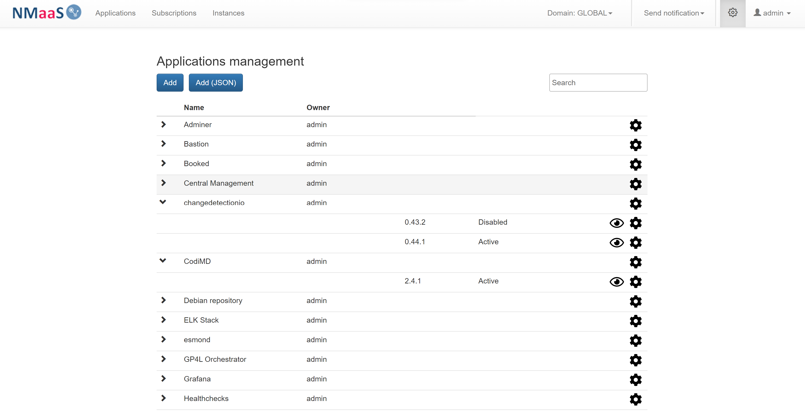
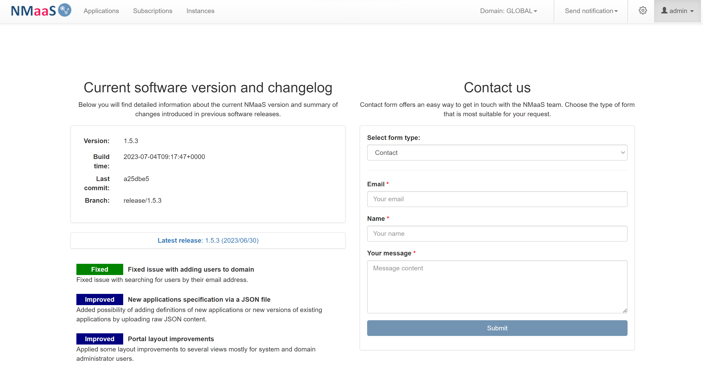

  

  <h3 align="center">NMaaS Platform (Back-end)</h3>

  <h4 align="center">Open-source multi-tenant platform for effortless, orchestrated deployment of software tools and applications on top of Kubernetes</h4>

  

     
    <a href="https://docs.nmaas.eu/">Explore documentation</a>
    ·
    <a href="https://github.com/nmaas-platform/nmaas-platform/issues">Report Bug</a>
    ·
    <a href="https://github.com/nmaas-platform/nmaas-platform/issues">Request Feature</a>
  

NMaaS is an open-source framework developed within the GÉANT project for orchestration of on-demand deployment of applications in a multi-tenant Kubernetes-based cloud environment.

With a simple self-service web interface, NMaaS applications are easily deployed within an isolated tenant environment assigned to a given user institution or team.

An application’s lifecycle (configuration updates and re-deployments) is fully managed following a GitOps approach: a specific Git repository is tightly associated with every deployed application and a set of CI/CD pipelines ensure proper re-deployments of the applications following every update on the Git master branch.

NMaaS applications are containerized and deployed using [Helm charts](https://helm.sh/).

## Screenshots

## NMaaS Platform Component 

[NMaaS Platform](https://github.com/nmaas-platform/nmaas-platform) is the central NMaaS component, exposing a REST API consumed by the NMaaS Portal. It stores the application catalog, the users, as well as information about any deployed applications. Upon a new request for an application deployment, it connects to the NMaaS Helm component and executes the necessary Helm command via an SSH connection. It also communicates with a self-hosted instance of GitLab, in order to provision boilerplate configuration files for the deployed application instances by the users, allowing them to make any additional configuration changes exclusively through Git.

### NMaaS Platform Development

Explore the NMaaS Platform [development and deployment](docs/DEVELOPMENT.md) documentation.

## Get in Touch

Interested users can use the following mailing lists to subscribe to news about NMaaS, get in touch with the NMaaS development team, or other NMaaS users:

- [nmaas-announce@lists.geant.org](mailto:nmaas-announce@lists.geant.org) - public mailing list for announcements shared by the NMaaS team with the community ([subscribe here](https://lists.geant.org/sympa/info/nmaas-announce))
- [nmaas@lists.geant.org](mailto:nmaas@lists.geant.org) - private mailing list for contacting the NMaaS core team members
- [nmaas-users@lists.geant.org](mailto:nmaas-users@lists.geant.org) - public mailing lists for discussions related to NMaaS usage and development ([subscribe here](https://lists.geant.org/sympa/info/nmaas-users))
